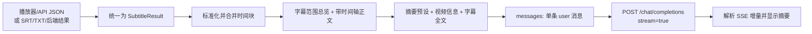

# 字幕到 LLM 摘要请求的完整流程

本文描述当前 `tampermonkey-bili-bot/src` 中“获取当前分集字幕并生成摘要”的实际代码链路。字幕时间轴整理和最终 Prompt 的组织方式参考了旧版 `bilibili-compase.js` 中的 `buildAiTranscript()`、`runSummary()` 和 `buildPromptWithTranscript()`。

## 一句话结论

当前流程并不是先固定拿到一个字幕文件再上传给 LLM，而是先从 B站播放器响应、B站字幕 API、字幕后端或用户上传内容中取得字幕，再统一转换成：

```ts
interface SubtitleResult {
  transcript: string;
  segments: Array<{
    from: number;
    to: number;
    content: string;
  }>;
  source: 'capture' | 'api' | 'manual' | 'backend';
}
```

播放器 JSON、B站 API JSON 和 SRT 会先标准化为带 `from`、`to`、`content` 的字幕段。生成摘要前，再参考 `bilibili-compase.js` 把相邻字幕合并成带 `[开始-结束]` 的时间块，并添加字幕范围总览。最后依次拼接“摘要指令、视频信息、字幕说明、带时间轴的字幕全文”，作为一条 `user` 消息，通过 OpenAI Chat Completions 兼容接口流式发送给 LLM。纯 TXT 或粘贴文本没有结构化时间轴时，直接使用原始文本。



## 1. 字幕从哪里来，原始格式是什么

### 1.1 自动获取的优先顺序

`BilibiliPlatformAdapter.fetchSubtitle()` 按下面的顺序尝试：

1. 捕获播放器发出的字幕网络响应。
2. 捕获失败后请求 B站字幕 API；第一次未取得字幕时，等待约 1.5 秒再重试一次。
3. 如果仍然没有字幕，并且用户启用了字幕后端，则调用字幕后端。
4. 自动链路仍未取得字幕时，用户可以上传或粘贴字幕。

播放器捕获和 B站 API 取得的通常不是 `.srt` 文件，而是 JSON 字幕数据。典型结构为：

```json
{
  "body": [
    {
      "from": 0.2,
      "to": 3.8,
      "content": "第一句字幕"
    },
    {
      "from": 4.0,
      "to": 7.1,
      "content": "第二句字幕"
    }
  ]
}
```

B站字幕列表接口为：

```text
GET https://api.bilibili.com/x/player/wbi/v2?cid=<CID>&bvid=<BVID>
GET https://api.bilibili.com/x/player/v2?cid=<CID>&bvid=<BVID>
```

代码优先选择语言为 `zh-CN` 或 `ai-zh` 的字幕，找不到时使用列表中的第一条，然后下载 `subtitle_url` 指向的 JSON 正文。

### 1.2 JSON 字幕的兼容字段

`normalizeSubtitleSegments()` 会把不同来源的字段统一成 `{ from, to, content }`：

| 统一字段 | 可读取的原始字段 |
| --- | --- |
| `content` | `content`、`text`、`sentence`、`t`、`c` |
| `from` | `from`、`start_time`、`start`、`st` |
| `to` | `to`、`end_time`、`end`；缺失时使用 `from + d`，连 `d` 也没有时默认加 2 秒 |

正文会把连续空白压缩为一个空格并去掉首尾空白，空正文会被过滤，最后按 `from`、`to` 从小到大排序。

播放器捕获链路还会递归搜索嵌套 JSON，找到第一组可识别的字幕片段。

### 1.3 手动字幕

上传入口接受：

```text
.srt
.txt
text/plain
application/x-subrip
```

粘贴入口按 `manual.txt` 处理。

- SRT：解析序号、`开始时间 --> 结束时间` 和正文，去掉正文中的 HTML 标签，多行正文用空格合并，得到带时间的 `segments`。
- TXT 或普通粘贴文本：整段内容去掉首尾空白后直接成为 `transcript`，`segments` 为空。

### 1.4 字幕后端

字幕后端可以返回以下任一种结果：

- JSON 中的 `transcript` 和 `segments`；
- JSON 中的 `subtitle_url`，再下载 JSON、SRT 或纯文本；
- HTTP 响应正文直接返回 SRT 或纯文本。

后端请求声明的首选格式为 JSON，同时接受 JSON、SRT 和文本：

```json
{
  "output": {
    "language": "zh-CN",
    "timestamps": true,
    "preferred_format": "json",
    "accepted_formats": ["json", "srt", "text"]
  }
}
```

字幕后端的完整协议见 [`backend-subtitle-api.md`](./backend-subtitle-api.md)。

## 2. 字幕标准化与文本拼接

### 2.1 第一层：生成基础纯文本 `transcript`

对播放器 JSON、B站 API JSON 或解析后的 SRT 字幕，`formatTranscript()` 只取每个片段的 `content`，过滤空行后使用 `\n` 连接：

```ts
const transcript = subtitles
  .map((item) => item.content)
  .filter((text) => text.trim())
  .join('\n');
```

例如原始结构：

```json
[
  { "from": 0.2, "to": 3.8, "content": "第一句字幕" },
  { "from": 4.0, "to": 7.1, "content": "第二句字幕" }
]
```

生成的基础 `transcript` 是：

```text
第一句字幕
第二句字幕
```

TXT 和普通粘贴文本直接使用去掉首尾空白后的原文。字幕后端如果直接返回 `transcript`、`text`、`subtitle` 或 `content`，也优先使用这段原文；只有没有这些字段时才从 `segments` 拼接基础正文。

这份基础 `transcript` 用于页面展示、TXT 下载和没有结构化时间轴时的兜底。

### 2.2 第二层：参考 `bilibili-compase.js` 合并时间块

真正生成摘要或复制完整 Prompt 时，会调用 `buildAiTranscript(segments, transcript)`。处理顺序是：

1. 再次通过 `normalizeSubtitleSegments()` 标准化和排序字幕段。
2. `buildSubtitleBlocks()` 从第一段开始向后处理相邻字幕。
3. 当前块结束时间到下一段开始时间的间隔不超过 `1.2` 秒，并且合并后正文不超过 `110` 个字符时，将两段合并。
4. 合并时正文之间插入一个空格，块的结束时间取两段 `to` 的较大值。
5. 不满足合并条件时结束当前块，并从下一段创建新块。
6. `formatTranscriptWithTimeline()` 把每个块输出为 `[开始-结束] 正文`。

时间格式规则：

- 不足一小时使用 `分:秒`，例如 `0:07`、`12:35`。
- 达到一小时使用 `时:分:秒`，例如 `1:02:09`。
- 如果开始和结束格式化后相同，或者结束时间不大于开始时间，只显示一个时间点。

例如：

```json
[
  { "from": 0.2, "to": 3.8, "content": "第一句字幕" },
  { "from": 4.0, "to": 7.1, "content": "第二句字幕" },
  { "from": 9.2, "to": 14.0, "content": "第三句字幕" }
]
```

前两句间隔只有 `0.2` 秒且合并后未超过 110 个字符，因此会得到：

```text
[0:00-0:07] 第一句字幕 第二句字幕
[0:09-0:14] 第三句字幕
```

### 2.3 第三层：生成发送给 LLM 的 `aiTranscript`

`buildAiTranscript()` 会在时间轴正文前添加整体元信息：

示例输出类似：

```text
【字幕时间范围总览】
字幕覆盖范围: [0:00-1:35]
字幕段数: 42
整理后时间块: 18

【按时间范围整理的字幕】
[0:00-0:07] 第一句字幕 第二句字幕
[0:09-0:14] 第三句字幕
```

如果没有有效的结构化 `segments`，无法生成时间轴正文，`buildAiTranscript()` 就回退到基础 `transcript`。因此 SRT、播放器 JSON 和 B站 API JSON 会向 LLM 提供时间范围；TXT 和普通粘贴文本仍然发送纯文本。

摘要缓存键也使用 `aiTranscript` 的哈希。这样从旧的纯文本拼接切换为时间轴拼接后，不会误命中旧格式生成的摘要缓存。

## 3. 摘要指令从哪里来

当前摘要指令选择规则是：

```text
当前 activePresetId 对应预设的 prompt
    ↓ 找不到时回退
config.promptText
```

默认启用的预设是“极简白话版”，完整指令为：

```text
我极度没有耐心，不想动脑子，脾气暴躁且阅读困难。请用最直白的大白话给我解释这视频到底在说什么，在能解释清楚的前提下废话越少越好，禁止使用任何专业术语。请按以下顺序直接输出：1.【结论】直接告诉我核心意思；2.【具体讲了啥】用极简的白话说明来龙去脉；3.【关键点】列出最重要的几个要点；4.【对我有什么用】直接说明价值，如果是纯广告或水视频请直接告诉我避雷；5.【原链接】在最后附上视频原始链接。记住，不要任何寒暄、铺垫和解释，直接开始回答！
```

项目还内置“详细笔记版”“批判分析版”“行动清单版”和“时间轴定位版”，用户也可以在设置中修改预设提示词。

## 4. 摘要提示词及最终 Prompt 结构

### 4.1 API 摘要请求使用的 Prompt

`buildSummaryPrompt()` 按下面的顺序构造最终文本：

```text
<当前摘要预设的 prompt>

视频URL: <当前分集页面 URL>
视频标题: <视频标题>
所属课程/合集: <合集标题>             # 只有合集标题与视频标题不同时才添加
当前分集: P<页码> <当前分集标题>       # 同上
UP主: <UP 主名称>
视频简介: <视频简介，最多 1500 个字符> # 没有简介时不添加

字幕内容（每行开头的 [开始-结束] 是视频时间范围；回答涉及具体片段、原话或定位时，请尽量保留对应时间范围）:
<aiTranscript：字幕范围总览 + 带时间范围的字幕块>
```

只有不存在结构化时间轴时，字幕标题才会回退为：

```text
字幕内容:
<基础 transcript>
```

这里保持了 `bilibili-compase.js` 的核心结构：摘要指令放在最前面，接着是视频元信息，最后是带时间轴的字幕数据。当前 TypeScript 版本额外保留了合集标题和当前分集信息，避免多 P 视频缺少上下文。

`aiTranscript` 最多取 `config.fullDataMaxChars` 个字符，默认是 `64000`。超过时直接使用：

```ts
aiTranscript.slice(0, maxTranscriptChars)
```

这里是按 JavaScript 字符数从尾部截断，不会按字幕句子、时间块或 token 边界切分，也不会在发给 LLM 的正文中追加“已截断”标记。

最终整段文本只放进一条 `user` 消息，没有单独的 `system` 消息：

```json
[
  {
    "role": "user",
    "content": "<上述完整提示词>"
  }
]
```

### 4.2 “复制提示词 + 字幕”使用的 Prompt

复制到其他 AI 时，使用和 `bilibili-compase.js` 中 `buildPromptWithTranscript()` 相同的分区思路，在内容外增加可读标题：

```text
===== 📝 AI 提示词 =====
<当前摘要预设的 prompt>

===== 📺 视频信息 =====
视频URL: <当前分集页面 URL>
视频标题: <视频标题>
所属课程/合集: <合集标题>             # 满足条件时添加
当前分集: P<页码> <当前分集标题>       # 满足条件时添加
UP主: <UP 主名称>
视频简介: <最多 1500 个字符>

===== 📄 字幕内容（带时间轴） =====
说明：下方先给出字幕覆盖范围总览，再给出每个片段的 [开始-结束] 时间范围。回答涉及具体片段时，请尽量带上对应时间范围。
<aiTranscript>

===== 💡 使用说明 =====
请将以上全部内容复制粘贴到任意 AI 对话（如 ChatGPT、DeepSeek、Kimi 等），即可生成视频摘要。
```

没有结构化时间轴时，标题改为 `===== 📄 字幕内容 =====`，不添加时间轴说明，正文使用基础 `transcript`。

## 5. 如何构造 HTTP 请求并发送给 LLM

### 5.1 请求地址

配置中的 `apiUrl` 会被规范化为 Chat Completions 地址：

- 填写 `https://example.com/v1`，最终请求 `https://example.com/v1/chat/completions`。
- 已经填写完整的 `/chat/completions` 地址时直接使用。
- 如果填写的是同一 API 下的 `/responses`、`/models` 等已知端点，会替换成 `/chat/completions`。

所以摘要链路实际按 OpenAI Chat Completions 兼容协议请求，不是按 OpenAI Responses API 的请求体发送。

### 5.2 请求头

```http
POST <规范化后的 /chat/completions 地址>
Content-Type: application/json
Authorization: Bearer <API Key>
Accept: text/event-stream
```

请求由 Tampermonkey 的 `GM_xmlhttpRequest` 发出。

### 5.3 请求体

默认请求体结构如下：

```json
{
  "model": "deepseek-v4-flash",
  "messages": [
    {
      "role": "user",
      "content": "<摘要预设 + 视频信息 + 字幕全文>"
    }
  ],
  "temperature": 0.7,
  "max_tokens": 4000,
  "stream": true
}
```

字段来源：

| 字段 | 来源与默认值 |
| --- | --- |
| `model` | 当前配置的模型，默认 `deepseek-v4-flash` |
| `messages` | 一条 `user` 消息，内容是完整摘要提示词 |
| `temperature` | 摘要链路没有主动传值，因此使用客户端默认值 `0.7` |
| `max_tokens` | `summaryMaxTokens`，默认 `4000`，会限制在 `500` 到 `30000` 之间 |
| `stream` | 固定为 `true` |

如果设置中关闭“思考”，还会加入两个兼容字段：

```json
{
  "thinking": { "type": "disabled" },
  "enable_thinking": false
}
```

如果开启“思考”，请求体不会显式发送开启字段，而是交给具体兼容 API 或模型使用其默认行为。

请求默认超时时间为 180 秒。

## 6. LLM 响应如何处理

客户端主要按 SSE 流处理响应：

```text
data: {"choices":[{"delta":{"content":"增量文字"}}]}
data: [DONE]
```

每收到一段文字就追加到 `fullText`，并通过 `onDelta` 把当前完整摘要更新到界面。

解析器还兼容以下常见返回位置：

- `choices[0].delta.content`
- `choices[0].message.content`
- `output_text`
- Responses 风格的 `output[].content[].text`
- Gemini 风格的 `candidates[0].content.parts`

需要注意：这里只是响应解析做了多种格式兼容，请求本身仍然使用 Chat Completions 的 `model + messages` 请求体。

如果响应的 `finish_reason` 是 `length`，代码会报错并提示调大摘要最大输出 token；如果流中没有取得任何文字，则报“API 响应格式异常”。用户中途停止时，如果已经收到部分内容，会保留部分摘要并追加“已被用户打断”。

## 7. 主调用链

```text
ParseController.start()
  -> BilibiliPlatformAdapter.fetchSubtitle()
     -> 播放器字幕捕获
     -> B站字幕 API
     -> 可选字幕后端
  -> ParseController.summarizeSubtitle()
  -> RuntimeSummaryService.summarize()
  -> buildAiTranscript()
  -> requestSummary()
  -> buildSummaryPrompt()
  -> callAiStream()
  -> buildChatRequestBody()
  -> GM_xmlhttpRequest(POST /chat/completions)
```

手动上传或粘贴时，入口改为：

```text
ParseController.startWithManualSubtitle()
  -> parseUploadedSubtitle()
  -> 后续与自动字幕相同
```

## 8. 关键代码位置

| 作用 | 文件 |
| --- | --- |
| 字幕统一结构和摘要请求结构 | `src/contracts/runtime.ts`、`src/contracts/video-context.ts` |
| 播放器字幕响应捕获 | `src/platform/bilibili/subtitle-capture.ts` |
| B站字幕列表和正文 API | `src/platform/bilibili/subtitle-api.ts` |
| 字幕标准化、SRT 解析、文本和时间轴拼接 | `src/platform/bilibili/subtitle-format.ts` |
| 自动字幕来源的优先级与回退 | `src/platform/bilibili/adapter.ts` |
| 字幕后端格式兼容 | `src/services/backend-subtitle.ts` |
| 自动/手动字幕进入摘要流程 | `src/runtime/parse-controller.ts` |
| 摘要参数映射及 `aiTranscript` 构造 | `src/runtime/summary-adapter.ts` |
| 复制完整 Prompt 时构造 `aiTranscript` | `src/runtime/feature-controller.ts` |
| 使用 `aiTranscript` 隔离摘要缓存 | `src/runtime/application.ts` |
| 最终提示词拼接 | `src/services/summary-service.ts` |
| Chat Completions 请求体、HTTP 请求和流式响应 | `src/services/ai-client.ts`、`src/services/api-url.ts` |
| 默认提示词和预设 | `src/config/presets.ts`、`src/config/defaults.ts` |
